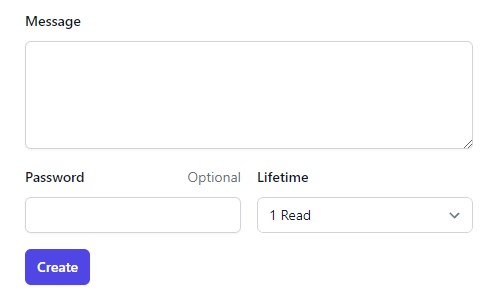

## What is this?

This is a simple web application that allows you to create a self-destructing message. 
The message will be automatically deleted after it has been read or upon reaching a specific expiration time.

The application is built using PHP / Laravel.

## Setup

1. `git clone git@github.com:Khazl/burn-after-read.git burn-after-read`
2. `cd burn-after-read`
3. `cp .env.example .env`
4. `composer install`
5. `sail up -d`
6. `sail artisan key:generate`
7. `sail npm install`
8. `npm run dev`

## License

This application is open-sourced software licensed under the [MIT license](https://opensource.org/licenses/MIT).
